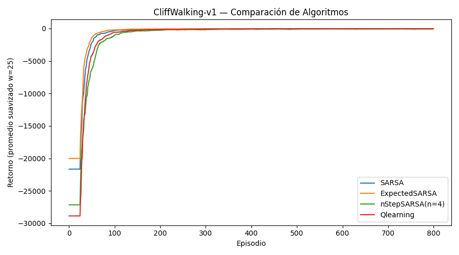

# Análisis de Resultados — CliffWalking-v1 TASK2

---

## **P1:** Diferencias en los patrones de recompensa entre SARSA y Q-Learning  
- **SARSA:** Muestra un aprendizaje más gradual y conservador, con menor variabilidad en las recompensas una vez que converge. Esto se debe a su naturaleza *on-policy*, que ajusta los valores Q a la política real (exploratoria) que sigue el agente.  
- **Q-Learning:** Aprende más rápido en las primeras fases, pero muestra oscilaciones más marcadas en ciertos bloques (por ejemplo, episodios 601-800) debido a que actualiza asumiendo siempre la acción óptima, incluso si no se ejecuta (*off-policy*).  
- En los resultados, SARSA alcanza un retorno final de **-17.80** frente a **-33.40** de Q-Learning, sugiriendo que en este entorno SARSA logra un comportamiento más seguro y estable.

---

## **P2:** Razón por la que Q-Learning tiende a ser más optimista  
Q-Learning es *off-policy* y actualiza siempre hacia el valor de la mejor acción posible (`max Q(s', a')`), lo que asume que el agente siempre actuará de manera óptima en el futuro.  
- Esto genera **sobreestimación** de valores Q en entornos con alta penalización por exploración (como CliffWalking), haciendo que persista en rutas arriesgadas antes de estabilizarse.

---

## **P3:** Efecto de la naturaleza *on-policy* de SARSA  
- SARSA actualiza usando la acción realmente tomada por la política ε-greedy, lo que **integra el riesgo de exploración** en su estimación.  
- Esto significa que aprende valores Q que reflejan la política real (incluyendo exploración), reduciendo el optimismo y favoreciendo estrategias más seguras.  
- En la práctica, esto explica por qué SARSA penaliza más rutas peligrosas y evita el “acantilado” más rápido que Q-Learning en este entorno.

---

## **P4:** Algoritmo que aprende el camino más seguro  
- **SARSA** parece aprender la ruta más segura:  
  - Retorno final: **-17.80** (mejor que Q-Learning: -33.40).  
  - Menores caídas en las recompensas promedio cada 100 episodios después de la convergencia.  
- La razón: al ser *on-policy*, internaliza el riesgo de caer durante la exploración, ajustando su política para minimizarlo.

---

## **P5:** Impacto de disminuir ε con el tiempo  
- **SARSA:** Al disminuir ε, reduce la exploración y refuerza las rutas seguras aprendidas. Esto tiende a **mantener la estabilidad** y reducir aún más las penalizaciones.  
- **Q-Learning:** Puede beneficiarse de la disminución de ε al reducir acciones aleatorias que lo llevan a sobreestimar rutas peligrosas, pero si ε baja demasiado rápido, podría converger prematuramente hacia una política subóptima.  
- En ambos casos, un decaimiento gradual (e.g., multiplicar por 0.995) suele equilibrar exploración y explotación de manera efectiva.

---

## **Notas adicionales**
- **Hiperparámetros**:  
  - Un α (tasa de aprendizaje) alto acelera la adaptación pero puede generar más oscilaciones.  
  - Un γ (factor de descuento) cercano a 1 hace que el agente valore más el largo plazo, crucial en entornos con castigos fuertes como este.  
  - Ajustar el decaimiento de ε permite balancear la exploración segura y la explotación temprana.
- **Teoría vs. Práctica**:  
  - La naturaleza *off-policy* de Q-Learning lo hace ideal para entornos deterministas y con bajo riesgo.  
  - La naturaleza *on-policy* de SARSA lo hace más robusto en entornos con penalizaciones severas por exploración, como CliffWalking.

---

## Preguntas adicionales

1. **Valor de mantener diferentes niveles de existencias por producto**  
   En un contexto de inventarios, mantener un nivel de existencias más alto reduce el riesgo de faltantes pero aumenta el costo de almacenamiento. El valor estimado debe balancear ambos, similar a cómo en CliffWalking balanceamos el riesgo de caer vs. la recompensa final.

2. **Impacto de ε en política blanda**  
   Un ε alto incrementa la exploración (más riesgo, pero potencialmente más descubrimiento de rutas óptimas). Un ε bajo favorece explotación (menos riesgo, pero puede estancarse en soluciones subóptimas).

3. **Impacto de aprendizaje *off-policy* vs *on-policy***  
   - *Off-policy* (Q-Learning): aprende la política óptima independientemente de la que sigue, pero puede sobreestimar valores y tomar rutas más arriesgadas durante la exploración.  
   - *On-policy* (SARSA): aprende la política que realmente ejecuta, integrando el riesgo de exploración y favoreciendo rutas seguras.
