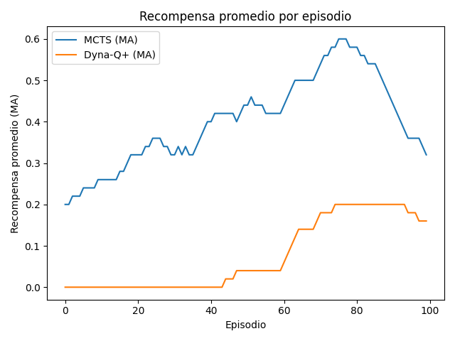
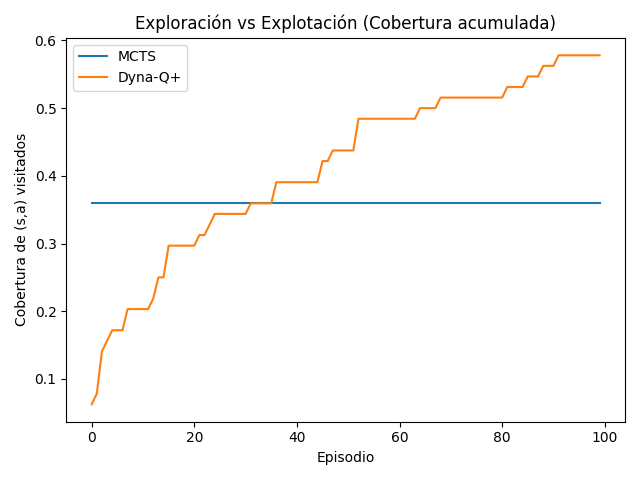
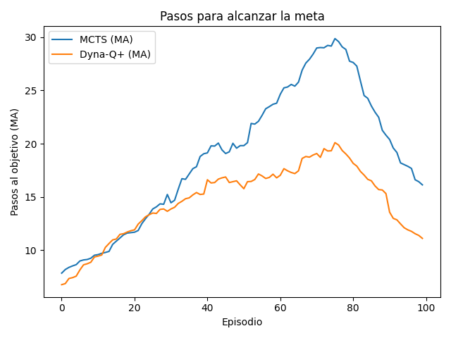
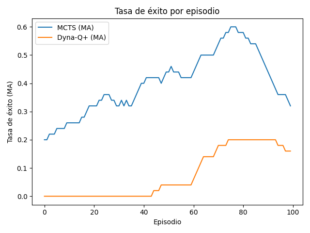

# CC3104 - RL - Laboratorio 6 - Task 2 (MCTS vs Dyna-Q+ en FrozenLake-v1)

Este repositorio contiene una comparación entre **MCTS (con UCT)** y **Dyna‑Q+** en el entorno `FrozenLake-v1` de **Gymnasium** (`is_slippery=True`).

## Estructura

- `envUtils.py` — Funciones auxiliares para crear el entorno y discretizar estados.
- `mcts.py` — Implementación de Monte Carlo Tree Search con UCT y manejo de transiciones estocásticas.
- `dynaQAgent.py` — Implementación de Dyna‑Q+ con modelo, planificación y bonificación de exploración temporal.
- `experiment.py` — Lógica de corrida de episodios y recolección de métricas.
- `plots.py` — Gráficas solicitadas (éxito, recompensa, pasos, cobertura).
- `main.py` — Script principal: ejecuta ambos algoritmos, guarda CSVs y PNGs.
- `requirements.txt` — Dependencias mínimas.

## Uso

1. Crear venv e instalar dependencias:

   ```bash
   python -m venv .venv
   source .venv/bin/activate  # Windows: .venv\Scripts\activate
   pip install -r requirements.txt
   ```

2. Ejecutar el experimento:

   ```bash
   python main.py
   ```

   Esto generará en `./outputs/`:
   - `metrics_mcts.csv`, `metrics_dyna_q_plus.csv`
   - `success_rate.png`, `avg_reward.png`, `steps_to_goal.png`, `exploration_coverage.png`

## Parámetros clave

- **MCTS**: `num_simulations`, `max_depth`, `uct_c`, `gamma`.
- **Dyna‑Q+**: `alpha`, `gamma`, `epsilon`, `n_planning`, `kappa` (bonificación de exploración temporal).

## Notas

- `FrozenLake-v1` es estocástico por defecto (`is_slippery=True`), lo cual afecta planeación y retorno con ambos métodos.
- Para reproducibilidad se fija la semilla por defecto (`seed=777`). Ajuste a conveniencia.

## Evidencia

# 5. Análisis y Preguntas — MCTS vs Dyna-Q+ en FrozenLake-v1

## 5.a Comparación de resultados

Los experimentos muestran que **MCTS** alcanza una **tasa de éxito y recompensa promedio superiores** a Dyna-Q+. La curva de MCTS crece de manera más consistente y llega a estabilizarse en torno a una recompensa media mayor.  
Por el contrario, **Dyna-Q+** presenta una curva más lenta: comienza prácticamente en cero y sólo después de ~50 episodios empieza a mejorar, alcanzando un nivel más bajo de éxito y recompensa final.

En cuanto a pasos al objetivo, ambos algoritmos logran reducirlos con el tiempo, aunque MCTS inicialmente necesita más pasos debido a la exploración, mientras que Dyna-Q+ converge a trayectorias más cortas cuando logra aprender la política.

La cobertura de exploración muestra un patrón interesante:  

- **MCTS** mantiene un nivel relativamente fijo de cobertura, ya que enfoca su búsqueda en las ramas prometedoras.  
- **Dyna-Q+** incrementa progresivamente la cobertura gracias al bono de exploración temporal.

### Evidencia gráfica

- 
- 
- 
- 

## 5.b Fortalezas y debilidades

- **MCTS**
  - Pros
    - Planificación explícita: evalúa múltiples trayectorias antes de actuar.  
    - Buen desempeño en éxito/recompensa en entornos estocásticos.  
  - Cons
    - Costoso computacionalmente: requiere muchas simulaciones por paso.  
    - Menor cobertura de (s,a): puede ignorar pares poco explorados si no parecen prometedores.

- **Dyna-Q+**
  - Pros
    - Ligero y fácil de escalar a más episodios.  
    - El bono de exploración permite cubrir más del espacio de estados-acciones.  
  - Cons
    - Aprendizaje más lento en entornos con alta estocasticidad.  
    - Recompensa final y tasa de éxito más bajas que MCTS en este escenario.

## 5.c Impacto de la naturaleza estocástica

La dinámica probabilística de FrozenLake-v1 hace que una acción no siempre produzca la misma transición.  

- Para **MCTS**, esto significa que sus simulaciones deben muestrear múltiples posibles resultados, lo que aumenta el costo de cómputo pero le da robustez a la política.  
- Para **Dyna-Q+**, la estocasticidad introduce ruido en las actualizaciones del modelo y en las recompensas esperadas, ralentizando la convergencia.

---

# Preguntas

## 1. Estrategias de exploración

La **bonificación de exploración** en Dyna-Q+ empuja al agente a seguir probando pares (s,a) poco visitados, aumentando la cobertura. En contraste, MCTS depende de **UCT** para balancear exploración-explotación dentro de su árbol.  
En este experimento, **MCTS converge más rápido** a una política útil en FrozenLake-v1, porque su búsqueda profunda le permite evaluar rutas completas hacia la meta incluso con estocasticidad.

## 2. Rendimiento del algoritmo

**MCTS supera a Dyna-Q+** en tasa de éxito y recompensa promedio.  
Esto ocurre porque MCTS puede anticipar secuencias de acciones exitosas aun cuando las transiciones son inciertas, mientras que Dyna-Q+ necesita muchas experiencias reales para ajustar su Q-table. El costo de simulación se traduce en mejor desempeño final.

## 3. Impacto de las transiciones estocásticas

Las transiciones probabilísticas afectan de manera diferente:

- **MCTS**: debe considerar múltiples desenlaces por acción, lo que encarece la simulación pero le da resiliencia.  
- **Dyna-Q+**: recibe muestras ruidosas que retrasan el aprendizaje.  
En general, **MCTS es más robusto a la aleatoriedad**, ya que planea bajo distribuciones, no solo experiencias individuales.

## 4. Sensibilidad de los parámetros

En **Dyna-Q+**, aumentar el número de pasos de planificación `n` acelera la propagación de valores, pero con costo computacional mayor. Un `n` demasiado bajo retrasa la convergencia.  
El parámetro `κ` de la bonificación controla cuán agresiva es la exploración:  

- `κ` alto → mayor cobertura, pero riesgo de inestabilidad.  
- `κ` bajo → más explotación, pero posible estancamiento.  

En una versión **determinista de FrozenLake**, se necesitarían valores de `n` y `κ` más bajos, ya que la incertidumbre de las transiciones desaparece y el aprendizaje se vuelve más estable.

---
